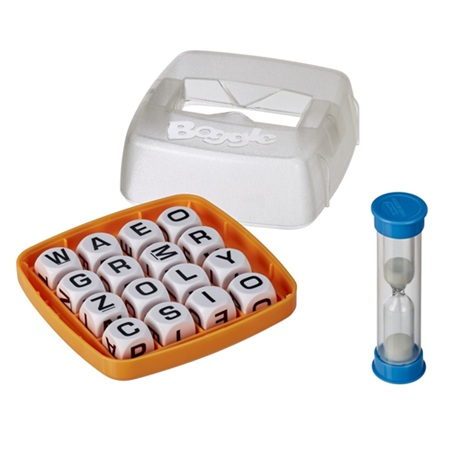
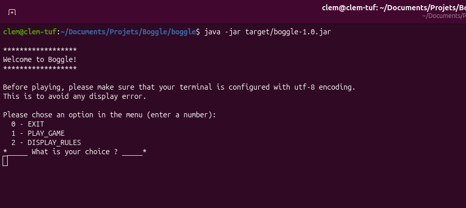
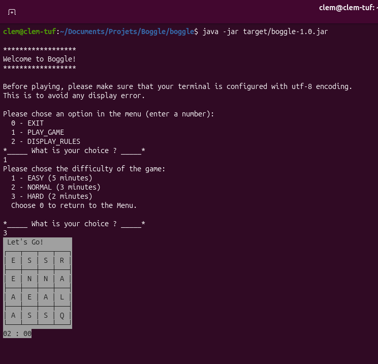
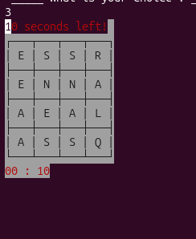
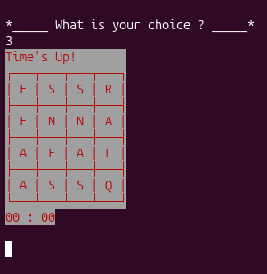

# Boggle
Projet de développement d'une version virtuelle, en Java, du plateau de jeu Boggle ainsi que son Timer.

Le concept complet est [ici](Boggle_Concept.pdf)

### Informations importantes
Ce projet est mis en suspens à compter du 23 septembre 2026.
J'ai pris plaisir à le développer, mais il est relativement basique, et je souhaite consacrer plus de temps sur la pratique de sujets que je suis en train d'apprendre (Spring, par exemple). Le jar est fonctionnel, mais je n'estime pas le travail fini pour autant. Je compte ajouter une possibilité de quitter proprement le jeu ou de revenir au menu une fois une partie terminée. Je compte égelement toujours faire une appli équivalente pour site web ainsi que pour Android. Cependant, ces fonctionnalités devront attendre un peu.

__Voici le rendu actuel:__

---

### Outils utilisés: 
- Version `jar` terminal :
  - ***Uml*** : StarUML
  - ***Développement*** : IntelliJ, Maven
  - ***Tests*** : JUnit
  
---

### Avancement global
- ***25/08/2026*** : Création du repository Git
- ***29/08/2026*** : UML majoritairement terminé pour le plateau de jeu. Recherches à effectuer pour le `Timer`. Projet Maven avec archétype "Quickstart" créé.
- ***03/09/2026*** : Classe `Die` rédigée et testée avec succès.
- ***07/09/2026*** : Début de rédaction de la classe `Grid`.
- ***09/09/2026*** : Rédaction des tests pour la classe `Grid`; les tests réussissent. 
- ***11/09/2026*** : Réflexions sur les mises en place d'énums et de la classe `GameManager`.
- ***14/09/2026*** : Début de la rédaction de la classe `GameManager`.
- ***18/09/2026*** : Refonte de `GameManager`: ses responsabilités d'affichage ne nécessitant pas d'interactions ont été déléguées à une nouvelle classe: `TerminalDisplay`.
- ***23/09/2026*** : `Main`rédigé. Débugage global effectué, l'appli est fonctionnelle. Le jar a été uploadé.

_Pour constater l'évolution dans les détails, j'ai fait en sorte de rendre mes commits le plus clair possible_
